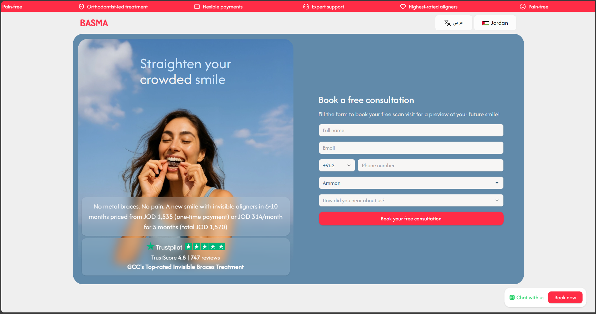
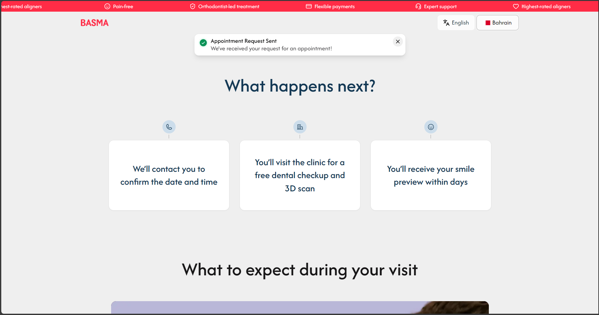
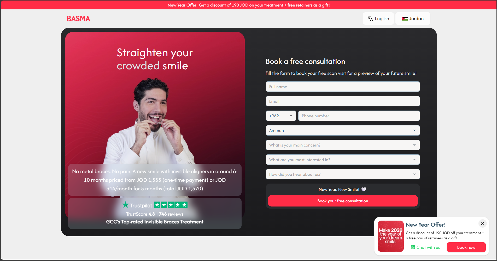
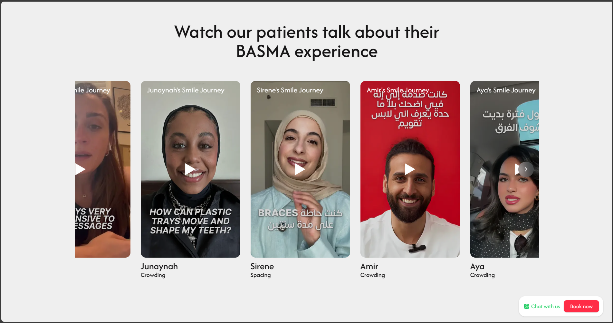
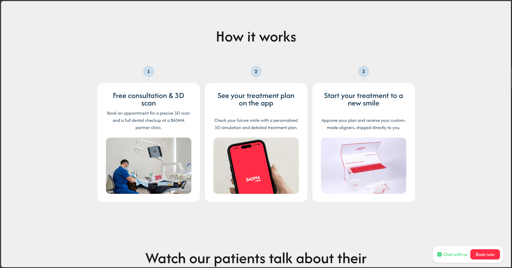

# BASMA Landing Page

**A high-performance, conversion-focused landing page**

> This repository serves as a portfolio showcase. The source code is proprietary to Basma and is not publicly available.

Designed to handle high-traffic campaigns, support seamless Arabic/English internationalization (RTL/LTR), and integrate with a server-side attribution tracking system.

## Key Features

### 1. Performance

- **Next.js:** Utilizes React Server Components (RSC) for optimal initial load times and SEO scores.
- **Cutom A/B Testing:** Implements custom logic to split traffic between variant groups dynamically. The A/B testing logic is fully configurable, allowing teams to define traffic split ratios and variant rules.

### 2. Integrations

- **Server-Side Attribution:** Custom integration that captures UTM parameters and user signals, validating and syncing them with the server.
- **Server-Side Tracking:** Integrated with Meta Conversions API, TikTok Events API, and Google Analytics for reliable, cookie-independent event tracking and attribution.
- **Dynamic Page Building:** A component-driven architecture allowing non-technical teams to construct landing page variants using a "Page Builder" configuration.

### 3. Configurability
|         Base Landing             |           Success Page           |
| :------------------------------: | :------------------------------: |
|    |  |

The landing page is fully configurable by non-technical teams through a CMS integration. This enables:

- **Variant Management:** Create and manage multiple page variants without code changes.
- **Time-Based Content:** Schedule content modifications to go live at specific times.
- **Ad Campaign Targeting:** Customize page content based on active ad campaigns and UTM parameters.
- **Geo-Targeting by Lead Country:** Display localized content, pricing, and offers.
- **Component-Level Editing:** Modify text, images, CTAs, and section visibility directly from the CMS.

|          NY Campaign             |          KSA Variant           |          Ramadan Campaign          |
| :------------------------------: | :----------------------------: | :--------------------------------: |
|    |  |  |

## Demo

https://github.com/user-attachments/assets/ff7e7fe7-7c7c-4272-9e76-5a237004a153

---

## Screenshots

|                                         |                                         |                                         |
| :-------------------------------------: | :-------------------------------------: | :-------------------------------------: |
|  |  |  |

---

<!-- ## Technical Stack
- **Frontend:** Next.js.
- **Backend:** Laravel, NestJS, MySQL, Redis.
- **Libaries:** Tailwind CSS, React Query, React Hook Form, Zod, Framer Motion, React Intl. -->